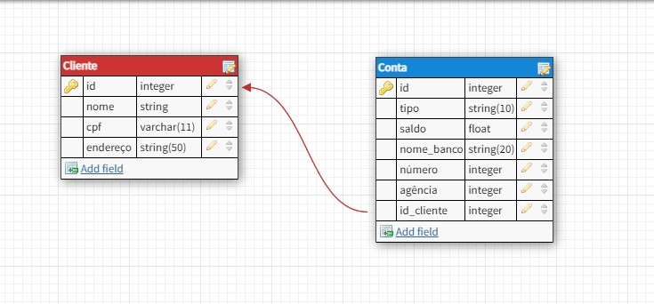

### Desvendando a fusão de Python com bancos de dados SQLite e MongoDB

Neste desafio implementei uma aplicação de integração com SQLite, com base em um esquema relacional disponibilizado. Sendo assim, utilizei o esquema dentro do contexto de cliente e conta para criar as classes da API. Essas classes representam as tabelas do banco de dados relacional dentro da aplicação.

